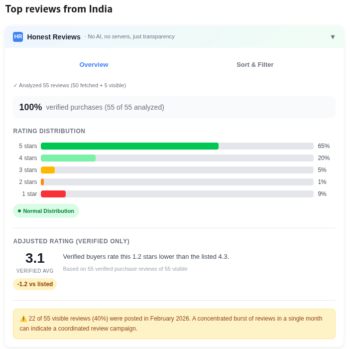
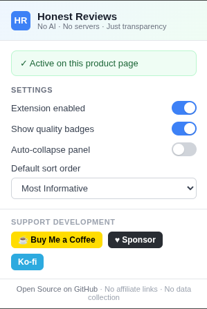

# Honest Reviews

> **The review layer that doesn't lie to you. Amazon & Flipkart.**

[](LICENSE)
[](https://buymeacoffee.com/NerfLongshot)
[](https://ko-fi.com/vighneshpath)

---

That 4.3-star product you're about to buy? Verified buyers might actually rate it **3.1 stars**. And 40% of those glowing reviews might have been posted in a single month.

Honest Reviews surfaces what Amazon and Flipkart bury — right on the product page, with no accounts, no servers, and no AI guesswork.

---

## What it looks like

### The Overview — spot the real signal instantly



That product has a **listed rating of 4.3**. Honest Reviews recalculates it using only verified purchase reviews: **3.1 stars — 1.2 lower than advertised.** Below the histogram, a burst warning: 40% of all reviews arrived in a single month. That's not organic.

### Sort & Filter — read the reviews that actually matter


Every review gets a **quality score (0–100)** based on length, helpful votes, verified status, photos, and recency. The most informative reviews surface first — not the most recent five-stars.

### Settings — full control, zero friction



Enable or disable per-tab, toggle quality badges, set a default sort order. Changes take effect immediately — no page reload needed.

---

## Why this exists

Fakespot shut down in July 2025. ReviewMeta is gone. The two biggest review analysis extensions are dead, leaving a gap filled by weak alternatives that use opaque AI to "detect fakes" — a claim they can't actually back up.

**Our approach is different.** We don't claim to detect fake reviews. We surface the data that's already embedded in the page and let *you* decide:

- What does the distribution actually look like?
- Do verified buyers rate this differently from everyone else?
- Did a suspiciously large chunk of reviews arrive all at once?
- Which reviews are actually worth reading?

**Zero server costs. Fully client-side. Open source. No affiliate links. No data collection.**

---

## Features

### Adjusted Rating
Recalculates the star average using **verified purchase reviews only** — filtering out reviews from people who may have received the product for free or never bought it at all. The delta (e.g. *−1.2 vs listed*) tells you how much unverified reviews are moving the needle.

### Rating Distribution
Visual histogram pulled from Amazon's own data — not sampled or estimated. Two patterns to watch:
- **Bimodal (J-curve)** — lots of 5-stars and 1-stars, few in between. Often signals fake inflation on top of a genuinely polarizing product.
- **Overwhelmingly positive** — 90%+ five-stars is unusual for most products. Worth scrutinizing.

### Review Burst Detection
Flags when an unusually high proportion of reviews arrived in a single month. Healthy products accumulate reviews steadily over time. A burst like *"40% of all reviews posted in February 2026"* is a signal — not proof, but worth knowing.

### Verified Purchase Ratio
What percentage of the reviews analyzed carry Amazon's verified purchase badge. Below 60% means a significant portion of reviews may not come from actual buyers.

### Quality Score (0–100)
Every review is scored on six signals:

| Signal | Max | What it measures |
|--------|-----|-----------------|
| Length | 30 | Longer reviews tend to be more informative. Full score at 600+ characters. |
| Helpful votes | 25 | Other shoppers found this useful. Full score at 20+ votes. |
| Verified purchase | 15 | Amazon confirmed this reviewer bought the product. |
| Has photos | 10 | Images suggest firsthand experience. |
| Recency | 10 | Full score within 3 months. Products change. |
| Nuanced rating | 10 | Bonus for 2–3 star reviews — usually the most balanced and specific. |

**Color coding:** 🟢 75–100 · 🔵 50–74 · 🟡 25–49 · ⚫ 0–24

### Sort Modes
| Mode | What it does |
|------|-------------|
| **Most Informative** *(default)* | Quality score. Surfaces long, helpful, verified reviews regardless of star rating. |
| **Most Helpful** | Helpful vote count — what other shoppers found most useful. |
| **Top Rated** | 5-star first. |
| **Critical** | 1-star first. Good for finding dealbreakers fast. |
| **Most Recent** | Newest first. Useful for products that change over time. |

### Quick Filters
**Verified only** · **Has photos** · **Detailed** (min 150 characters) — stackable, instant.

---

## Supported Sites

| Site | Status |
|------|--------|
| **Amazon** (.com, .co.uk, .de, .fr, .it, .es, .ca, .com.au, .co.jp, .in) | Full support |
| **Flipkart** | Full support |

---

## How reviews are fetched

### Amazon
One page (~10 reviews) per star tier in this order: **3-star → 4-star → 2-star → 1-star → 5-star**, giving ~50 reviews across all rating levels. Within each tier, Amazon returns their highest helpful-vote reviews. This is a **stratified cross-section** — prioritizing nuanced 3-star reviews first.

### Flipkart
Flipkart has no per-star filter, so we use **sort order as pseudo-stratification**: one page each of **Most Helpful**, **Negative** (low-star first), and **Positive** (high-star first). This gives a representative cross-section of ~30 reviews covering the full rating spectrum.

---

## Privacy

- **No data leaves your browser.** All analysis is local.
- **No servers, no accounts, no tracking.**
- The only network requests made are to Amazon's or Flipkart's own review endpoints, using your existing session. No third-party requests, ever.

---

## Installation

### Chrome / Chromium
1. Download the latest `honest-reviews-chrome-vX.Y.Z.zip` from [Releases](../../releases)
2. Unzip it
3. Go to `chrome://extensions` → enable **Developer mode** (top-right toggle)
4. Click **Load unpacked** → select the unzipped `chrome-mv3` folder

### Firefox
1. Download the latest `honest-reviews-firefox-vX.Y.Z.zip` from [Releases](../../releases)
2. Unzip it
3. Go to `about:debugging` → **This Firefox** → **Load Temporary Add-on**
4. Select any file inside the unzipped folder

> Permanent Firefox installation requires a signed add-on. Temporary add-ons are removed on restart.

### Development
```bash
git clone https://github.com/VighneshPath/HonestReviews
cd honest-reviews
npm install
npm run dev          # Chrome with HMR
npm test             # 181 unit tests, ~1s
```

---

## Project Structure

```
src/
├── entrypoints/        # WXT entry points (content script, popup, background, settings relay)
├── sites/              # Site registry — the single place to add new site support
│   ├── adapter.ts      # SiteAdapter interface (the contract every site implements)
│   ├── index.ts        # SITE_FACTORIES registry, detectSite(), isKnownProductPage()
│   ├── amazon.ts       # createAmazonAdapter() factory
│   └── flipkart.ts     # createFlipkartAdapter() factory
├── parsers/
│   ├── review.ts       # ParsedReview interface (site-neutral)
│   ├── product.ts      # ProductPageData + StarDistribution interfaces (site-neutral)
│   ├── dom-utils.ts    # Generic DOM query helpers (queryFirst, queryAll)
│   ├── fetch-utils.ts  # Shared fetch helpers (sleep, deduplicateReviews)
│   ├── amazon/         # Amazon DOM parsing — all selectors in selectors.ts
│   └── flipkart/       # Flipkart DOM parsing (product page, review list, review fetcher)
├── stats/              # Pure statistical functions (no DOM)
│   ├── adjusted-rating.ts
│   ├── distribution-analysis.ts
│   ├── review-quality.ts   ← quality score formula
│   ├── review-sorter.ts
│   └── timeline-analysis.ts
├── components/         # Lit web components (Shadow DOM), each with a paired .css file
├── storage/            # Settings types and storage helpers
└── utils/              # URL matching helpers (amazon-url.ts, flipkart-url.ts)
tests/
├── unit/               # Vitest unit tests (181 tests, ~1s)
└── fixtures/           # Saved HTML snapshots
```

---

## Limitations

- **Review count**: ~50 reviews on Amazon (one page per star tier), ~30 on Flipkart (three sort orders). Products with thousands of reviews are not fully represented.
- **Flipkart fetch**: Flipkart is a React SPA — the background-fetched review pages may return empty if server-side rendering isn't in place. The extension gracefully falls back to the product page's visible reviews.
- **Language**: Optimized for English. Date parsing may degrade on non-English locales.
- **DOM changes**: Sites occasionally update their page structure. If something breaks, the fix is almost always in the relevant `selectors.ts` or parser file.
- **Not fake-review detection**: Genuine fake detection requires ML and historical data. We don't pretend otherwise. What we offer is transparency into what the visible data shows.

---

## Contributing

PRs welcome. Most impactful areas:

1. **Amazon selector updates** — when Amazon changes their DOM, update `src/parsers/amazon/selectors.ts`
2. **Flipkart selector updates** — update `src/parsers/flipkart/review-list.ts` and `product-page.ts`
3. **More sites** — see `src/sites/index.ts` for the contributor guide; adding a site touches at most two existing files
4. **More locales** — test on non-.com Amazon domains, fix date parsing edge cases
5. **Quality formula tuning** — improve the scoring in `src/stats/review-quality.ts`

Run `npm test` before submitting.

---

## License

MIT — see [LICENSE](LICENSE)
